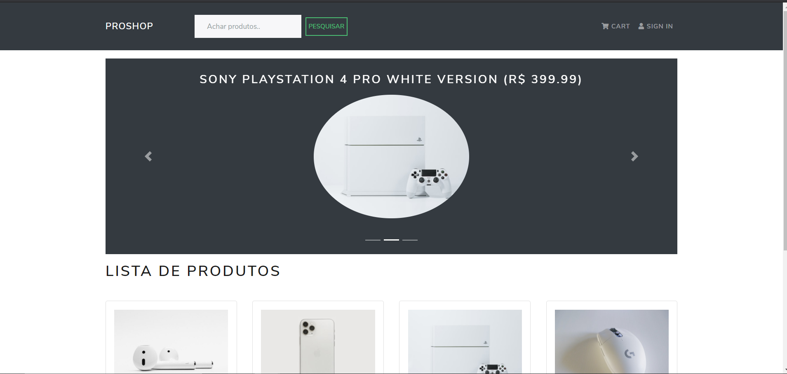
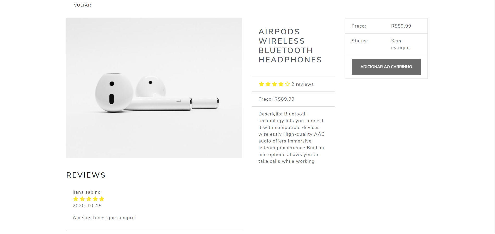

<h1 align="center">
    ProShop
</h1>

  <a href="#-tecnologias">Tecnologias</a>&nbsp;&nbsp;&nbsp;|&nbsp;&nbsp;&nbsp;
  <a href="#-projeto">Projeto</a>&nbsp;&nbsp;&nbsp;|&nbsp;&nbsp;&nbsp;
  <a href="#memo-licença">Licença</a>

 

  

 

  

  

## 🚀 Tecnologias

Esse projeto foi desenvolvido com as seguintes tecnologias:

- [Node.js](https://nodejs.org/en/)
- [React](https://reactjs.org)
- [Mongoose](https://mongoosejs.com/)
- [Redux](https://redux.js.org/)
- [JavaScript](https://developer.mozilla.org/pt-BR/docs/Web/JavaScript)

## 💻 Projeto

O ProShop é um shopping fictício, criado para treinar e praticar os conhecimentos de javascript e redux que é uma das bibliotecas mais famosas para gerenciar estado do aplicativo, e varias outras tecnlogias. 💜

## 🧠 Ajude o projeto a crescer!

Caso encontre algum problema no projeto, crie um fork e depois uma nova branch com o nome da sua modificação. Em caso de duvidas, estou sempre a disposição :)

## :memo: Licença

Esse projeto está sob a licença MIT. Veja o arquivo [LICENSE](LICENSE.md) para mais detalhes.

---

Feito com ♥ by Jefferson Brandão :wave: